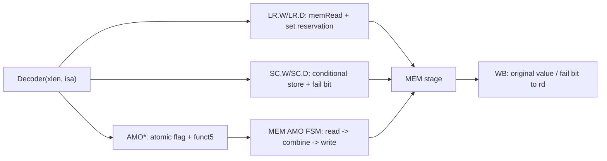

# A 原子扩展（RV32A / RV64A）— 技术设计

Feature Name: rv32a-atomics
Updated: 2026-09-19

## Description

在单发射按序五级流水线上实现 A 扩展。译码层识别 `opcode=0101111` 的 LR/SC/AMO 编码并产生新的控制域；MEM 级新增一个仅用于 AMO 的两状态「读→写」FSM，复用既有 `freezeAll` 冻结整条流水线实现原子性；LR/SC 通过一组保留寄存器实现。A 关闭时全部新增逻辑为空。

## Architecture

## Components and Interfaces

### 配置层（`isa/RvExtension.scala`、`isa/IsaConfig.scala`、`CoreConfig.scala`）

- `RvExtension.Atomic` 从 `reserved` 移入 `implemented`（`implemented = {M, A, Zicsr, C}`）。
- `IsaConfig.rv32ima = IsaConfig(32, {Zicsr, MulDiv, Atomic}, MU)`，`rv64ima = IsaConfig(64, ...)`；`CoreConfig` 增加对应工厂。

### Decoder（`core/Decoder.scala`）

`DecodeOutput` 新增字段：`atomic`（A 类内存操作）、`isLr`、`isSc`、`amoOp: UInt(5 bits)`。

| opcode | funct3 | funct5 | 语义 |
|--------|--------|--------|------|
| 0101111 | 010 | 00010 | `LR.W`：`memRead`，`wbSel=MEM`，置 `atomic/isLr` |
| 0101111 | 010/011 | 00011 | `SC.W/SC.D`：置 `memWrite/atomic/isSc` |
| 0101111 | 010/011 | 其余合法 | `AMO*.W/D`：置 `atomic/amoOp` |
| 0101111 | 011 | — | RV32 上 D 形式非法（cause 2） |
| 0101111 | — | 保留 funct5 | 非法（cause 2） |

A 关闭时 opcode `0101111` 一律非法。

### 流水线字段

`IdExBundle` / `ExMemBundle` 同步新增 `atomic/isLr/isSc/amoOp`，并加入各自的 `zero()`。

### RiscvCore（`RiscvCore.scala`）

**保留集（LR/SC）**

- `resvValid: Bool`、`resvAddr: UInt(xlen)`。
- LR 在 MEM 完成时 `resvValid := True; resvAddr := memAddr`。
- SC 成功条件 `scSuccess = resvValid && resvAddr === memAddr`；失败时不驱动总线写。
- 任一存储、SC 或 AMO 提交时清除保留集。

**AMO FSM（仅 `withAtomic`）**

- 两状态：`0=READ`（驱动读，锁存 `amoOld := readData`）→ `1=WRITE`（驱动写，完成后释放冻结）。
- `amoStall = isAmo && !(state===WRITE && dBus.ready)`，并入 `freezeAll`。
- 组合运算 `amoCombine(width, funct5, old, rs2)`：ADD/SWAP/XOR/OR/AND/MIN/MAX/MINU/MAXU。
- W 形式在 32 位运算并按有符号扩展；D 形式在 xlen 宽度运算。
- 总线写数据源在 AMO 写周期切换为 `amoNewValue`；写掩码沿用既有按 `memSize`/地址的分字节逻辑。

**总线与写回**

- `dBus.valid/write` 在 AMO 读/写周期由 FSM 驱动；普通 load/store 路径不变。
- `memWb.wbData`：LR/普通 load → `loadResult`；AMO → 符号扩展的原值；SC → 成败位（0/1）。
- 冒险：`stallData` 纳入 `idEx.atomic`；转发排除 `exMem.atomic`，保证 A 结果只在 WB 可见。

**对齐异常**

- EX 级检查 `idEx.atomic` 的有效地址：W 需 `addr(1:0)==0`，D 需 `addr(2:0)==0`。
- 违例 cause：LR→4（load），SC/AMO→6（store/AMO）；`mtval=addr`，并 bubble EX/MEM。

### RTL 生成（`RiscvCoreGen.scala`）

- 新增 `gen(CoreConfig.rv32ima, "RiscvCoreA")` 与 `gen(CoreConfig.rv64ima, "RiscvCore64A")`。
- 既有 `RiscvCore.v` / `RiscvCoreC.v` / `RiscvCore64C.v` 保持可生成。

## Correctness Properties

1. **A 关闭不变式**：`withAtomic=false` 时 A 分支被剪除，行为与变更前一致。
2. **原子性**：AMO 的读与写之间整条流水线冻结，外部观察不到中间态。
3. **结果时机**：A 结果经 WB 写回，消费者经既有停顿等待。
4. **SC 保守性**：允许更频繁的失败（规范允许），但成功时必满足预约有效且地址匹配。
5. **对齐**：非自然对齐在 EX 触发 cause 4/6，不产生访存。

## Error Handling

- A 关闭、RV32 D 形式、保留 funct5 → illegal-instruction（cause 2）。
- 非对齐 → cause 4（LR）/ cause 6（SC、AMO）。
- 目标退休时取消该指令及后续指令的流水线副作用。

## Test Strategy

- RV32A 程序：LR/SC 成功与失败、9 种 AMO 的返回值与内存结果、结果旁路。
- RV64A 程序：LR.D/SC.D、AMO*.W 符号扩展、AMO*.D 64 位比较。
- 对齐陷阱：非对齐 LR/AMO 的 cause 与 `mepc`。
- 保持既有全量测试通过，并生成 A 使能 RTL 验证 elaboration。
