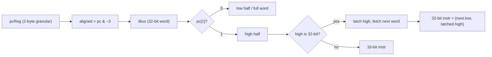

# RV32C 压缩指令扩展 — 技术设计

Feature Name: rv32c-compressed
Updated: 2026-09-14

## Description

在 `RiscvCore` 中实现 RV32C：取指阶段识别 16 位压缩指令并支持 2 字节 PC 粒度，译码阶段把压缩指令展开为等价的内部操作（复用既有 EX/MEM/WB 通路），配置层把 `RvExtension.Compressed` 从 `reserved` 提升为可实例化能力（仅 RV32）。C 关闭时生成逻辑与当前实现保持一致。

## Architecture

取指（IF）保持**32 位指令总线**不变，在核内做半字选择与拼接：

- `pcReg` 仍是当前取指地址，但语义变为 2 字节粒度；取指地址始终对齐到字（`pc & ~3`）。
- 当 `pc[1]=1` 且高半字为 32 位指令时，触发一次 "misaligned-32" 状态：锁存高半字，下一拍取下一个字，拼接后交付。该状态对流水线呈现为一次停顿（类似 `fetchStall`）。
- 其余情况单拍交付：`pc[1]=0` 时低半字为压缩或整字为 32 位；`pc[1]=1` 且高半字为压缩时直接取高半字。

## Components and Interfaces

### Decoder（`core/Decoder.scala`）

- 新增构造参数 `isa: IsaConfig`（已存在）派生的 `withCompressed`。
- 新增 `isComp = withCompressed && instr(1 downto 0) =/= "11"`。
- 结构：`when(isComp) { <压缩译码> } otherwise { <现有 32 位 switch> }`，两者写入同一 `DecodeOutput`。
- 压缩译码按 quadrant（`instr[1:0]`）→ `funct3`（`instr[15:13]`）逐条展开为既有字段（ALU 操作、memSize、branchType、跳转等）。RV64C/浮点/保留编码置 `illegal`。

### 压缩译码字段约定

| 压缩指令族 | 内部等价 |
|-----------|----------|
| `C.ADDI/C.LI/C.ANDI/C.ADDI16SP/C.ADDI4SPN` | `ADD` + 立即数，`aluSrc=1` |
| `C.LUI` | `ADD` with `aluASrc=ZERO`，imm = `sext6 << 12` |
| `C.SRLI/C.SRAI/C.SLLI` | `SRL/SRA/SLL`，shamt 取 `{instr[12],instr[6:2]}` 低位 |
| `C.SUB/XOR/OR/AND` | 对应 ALU 寄存器操作，`rs1=rs2=rd=compressed reg` |
| `C.J/C.JAL` | jump，wbSel=PC4；`C.JAL` 链接地址为 `pc+2` |
| `C.JR/C.JALR` | jump+jalr，imm=0；`C.JALR` 链接 `pc+2` |
| `C.BEQZ/C.BNEZ` | branch BEQ/BNE，rs2=x0 |
| `C.LW/C.LWSP/C.SW/C.SWSP` | `memSize=word`，宽/零扩展规则同 LW/SW |
| `C.MV` | `ADD` with `aluASrc=ZERO`, `aluSrc=0` |
| `C.ADD` | `ADD` 寄存器形式 |
| `C.EBREAK` | `sysOp=EBREAK` |

### RiscvCore（`RiscvCore.scala`）

- `IfIdBundle`/`IdExBundle` 新增 `compressed: Bool`（链接地址与 PC 增量使用）。
- IF 新增 `mis32` 状态寄存器与 `hiReg` 高半字寄存器（仅 `withCompressed` 时生成）。
- 新增 `instrLen = Mux(compressed, 2, 4)`；`pcReg` 顺序增量由 `+4` 改为 `+instrLen`。
- `freezeAll` 纳入 "misaligned-32 首次停顿"。停顿期间不更新 IF/ID、ID/EX。
- JAL/JALR 链接值改为 `idEx.pc + instrLen`。
- 数据冒险的源寄存器由 `ifId.instruction` 位切片改为 `dec.rs1/dec.rs2`，使压缩指令的源寄存器可被正确识别（对 32 位指令等价）。
- 配置校验：`require(isRV32 || !hasCompressed)`。

### 配置层（`isa/RvExtension.scala`、`isa/IsaConfig.scala`、`CoreConfig.scala`）

- `RvExtension.implemented` 增加 `Compressed`；`reserved` 移除之。
- `IsaConfig` 新增预设 `rv32imc`（RV32IMC_Zicsr，M/U）。
- `CoreConfig` 新增转发 `hasCompressed`。

## Correctness Properties

1. **C 关闭不变式**：`withCompressed=false` 时不生成 `mis32/hiReg`/压缩译码逻辑，`pcReg` 恒 `+4`，行为与变更前逐拍一致（由既有 27 项回归保证）。
2. **对齐**：`mepc` 记录的是压缩/32 位指令的精确地址；分支/跳转目标按 2 字节对齐。
3. **异常优先**：非法压缩编码以 cause 2 抛出，且不产生寄存器/CSR 副作用（复用 EX trap 通路）。
4. **misa 一致性**：`C` 位与 `Compressed` 使能严格同源。

## Error Handling

- 非法/保留压缩编码（含 RV64C 专属、浮点、`C.ADDI4SPN` nzuimm=0、`C.LUI` imm=0/rd=0、`C.LWSP` rd=0、RV32 shamt[5]=1 等）→ illegal-instruction（cause 2）。
- `c6=0` 的 shift（`C.SLLI/SRLI/SRAI` shamt 0）按 NOP/合法处理。
- `C.MV/C.ADD/C.LI/C.ADDI` 语义上的 HINT（rd=0）按无写回执行。

## Test Strategy

- 新增 `rv32imcProgram`：覆盖 Q0/Q1/Q2 代表指令、压缩与标准指令混合、`pc[1]=1` 起始的 32 位指令、以及非法压缩编码触发 trap。
- 既有 `RiscvCoreTest`/`ZicsrTrapTest`/配置单测全部保持通过（默认 C 关闭）。
- 分别生成 C 开/关两种配置的 RTL，确认 elaboration 成功。

## References

[^1]: (Website) - [RISC-V 非特权规范 C 扩展](https://riscv.org/wp-content/uploads/2019/12/riscv-spec-20191213.pdf)
[^2]: (File#L61) - [Decoder.scala](src/main/scala/rv32c/core/Decoder.scala)
[^3]: (File#L148) - [RiscvCore.scala](src/main/scala/rv32c/RiscvCore.scala)
