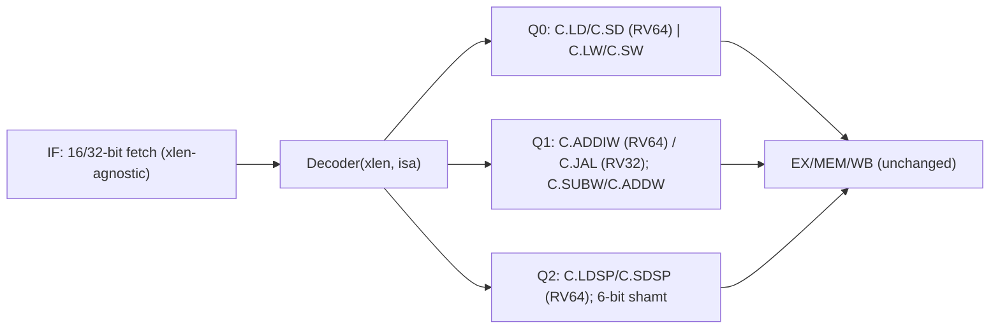

# RV64C 压缩指令扩展 — 技术设计

Feature Name: rv64c-compressed
Updated: 2026-09-17

## Description

在既有 RV32C 基础上补齐 RV64C：复用压缩取指通路（2 字节 PC、`pc[1]=1` 拼接），只在 `Decoder` 中按 `xlen` 增加 RV64 专属编码，并放开 `RiscvCore` 对 RV64C 的构造期拒绝。取指、PC 推进、链接值与冒险逻辑对 xlen 透明，RV32 与 C 关闭路径保持逐拍不变。

## Architecture

压缩译码在 `when(isComp)` 分支内按 quadrant 展开为既有内部字段（ALU 操作、`memSize`、跳转/分支等），`isComp = withCompressed && instr[1:0] != 11` 与 xlen 无关：

## Components and Interfaces

### 配置层（`isa/RvExtension.scala`、`isa/IsaConfig.scala`、`CoreConfig.scala`）

- `RvExtension.Compressed` 注释更新为"RV32/RV64 均实现"；`implemented` 集合不变。
- `IsaConfig` 新增预设 `rv64imc = IsaConfig(64, {Zicsr, MulDiv, Compressed}, MU)`。
- `CoreConfig` 新增 `rv64imc` 工厂。

### Decoder（`core/Decoder.scala`）

按 quadrant 增加 xlen 分支，其余压缩译码不变：

| 编码 | RV32 | RV64 |
|------|------|------|
| Q0 `funct3=011` | illegal（F 未实现） | `C.LD`，`memSize=doubleword` |
| Q0 `funct3=111` | illegal | `C.SD`，`memSize=doubleword` |
| Q1 `funct3=001` | `C.JAL`（`rd=x1`） | `C.ADDIW`（`rd=inst[11:7]`，`rd=0` 为保留） |
| Q1 `funct3=100`,`instr[12]=1`,`instr[11:10]=11` | illegal | `C.SUBW`/`C.ADDW` |
| Q1 `funct3=100`,`instr[12]=1`,`instr[11:10]=00/01` | illegal（shamt[5]=1） | 合法 6 位 shamt 的 `C.SRLI`/`C.SRAI` |
| Q2 `funct3=000`,`instr[12]=1` | illegal | 合法 6 位 shamt 的 `C.SLLI` |
| Q2 `funct3=011` | illegal | `C.LDSP`，`memSize=doubleword` |
| Q2 `funct3=111` | illegal | `C.SDSP`，`memSize=doubleword` |

### RV64C 立即数约定

| 指令 | 立即数编码 | 缩放 |
|------|-----------|------|
| `C.LD`/`C.SD` | `{instr[6:5], instr[12:10]}` | `<< 3` |
| `C.LDSP` | `{instr[4:2], instr[12], instr[6:5]}` | `<< 3` |
| `C.SDSP` | `{instr[9:7], instr[12:10]}` | `<< 3` |
| `C.ADDIW` | `{instr[12], instr[6:2]}`（6 位有符号） | 不缩放 |

### 压缩译码字段约定（RV64 增量）

| 压缩指令族 | 内部等价 |
|-----------|----------|
| `C.LD`/`C.LDSP` | `memRead`，`memSize=doubleword`，`aluOp=ADD`，`aluSrc=1` |
| `C.SD`/`C.SDSP` | `memWrite`，`memSize=doubleword`，`aluOp=ADD`，`aluSrc=1` |
| `C.ADDIW` | `ADDW` + 6 位立即数，`rs1=rd=inst[11:7]` |
| `C.SUBW`/`C.ADDW` | `SUBW`/`ADDW` 寄存器形式，`rs1=rs2=rd=compressed reg'` |
| 6 位 shamt 移位 | shamt 取 `{instr[12], instr[6:2]}`，`instr[12]` 在 RV64 合法 |

### RiscvCore（`RiscvCore.scala`）

- 删除 `require(xlen==32 || !hasCompressed)`；RV64C 与 RV32C 共用同一取指/流水线逻辑。
- `instrLenEx = Mux(compressed, 2, 4)`、`alignedPc = Cat(pcReg(xlen-1 downto 2), 0)`、`pcReg(1)` 判断均已按 `xlen` 参数化，无需修改。

### RTL 生成（`RiscvCoreGen.scala`）

- 新增 `gen(CoreConfig.rv64imc, "RiscvCore64C")`，输出 `rtl/RiscvCore64C.v`，验证 RV64C 可成功 elaboration。既有 `RiscvCore.v`（RV32IM）与 `RiscvCoreC.v`（RV32IMC）保持不变。

## Correctness Properties

1. **RV32 不变式**：所有 RV64C 分支均由 `if (!isRV64)` 短路；RV32 路径逐位不变。
2. **C 关闭不变式**：`withCompressed=false` 时不生成压缩译码逻辑，行为与变更前一致。
3. **xlen 合法性**：RV64 专属编码在 RV32 上必须触发 cause 2；反之 RV32 专属（`C.JAL`）在 RV64 上被 `C.ADDIW` 取代。
4. **misa 一致性**：`C` 位与 `Compressed` 使能同源，与 xlen 无关。
5. **地址精确**：`mepc` 记录压缩指令精确地址；分支/跳转目标按 2 字节对齐。

## Error Handling

- 非当前 xlen 的专属编码与保留编码（`C.LD/C.SD/C.LDSP/C.SDSP` on RV32、`C.SUBW/C.ADDW` 之外的形式、RV32 shamt[5]=1、`C.ADDIW rd=0`）→ illegal-instruction（cause 2）。
- `C.ADDIW` 复用 `ADDW` 语义，结果按 32 位截断后符号扩展至 64 位。

## Test Strategy

- 新增 `rv64cProgram`：`C.LD/C.SD`、`C.LDSP/C.SDSP`、`C.ADDIW`、`C.SUBW/C.ADDW`、shamt≥32 的 `C.SLLI/C.SRLI/C.SRAI`、以及 `pc[1]=1` 起始的压缩/32 位混合，自循环结束。
- 保持 RV32C 现有用例（含保留编码 trap）全绿；默认 C 关闭配置全绿。
- 生成 RV32（C 开/关）与 RV64C RTL，确认 elaboration 成功。

## References

[^1]: (Website) - [RISC-V 非特权规范 C 扩展](https://riscv.org/wp-content/uploads/2019/12/riscv-spec-20191213.pdf)
[^2]: (File#L148) - [Decoder.scala](src/main/scala/rv32c/core/Decoder.scala)
[^3]: (File#L197) - [RiscvCore.scala](src/main/scala/rv32c/RiscvCore.scala)
