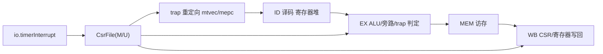

# 技术设计：Zicsr、异常/中断与 M/U 特权（zicsr-exceptions）

Feature Name: zicsr-exceptions
Updated: 2026-09-05

## Description

在现有 RV32IM 五级流水线（`RiscvCore`，见 `src/main/scala/rv32c/RiscvCore.scala`）之上实现：

1. Zicsr 六条 CSR 访问指令（`CSRRW/CSRRS/CSRRC` 及立即数形式）；
2. Machine 级 CSR 最小集与机器/用户两个权限模式；
3. 同步异常（`ECALL`/`EBREAK`/非法指令）与单路定时器中断的捕获、入口跳转与 `MRET` 返回。

约束：改动遵循现架构（组合译码 + 流水寄存器 + `freezeAll` 统一冻结，`RiscvCore.scala:274`），位宽参数化来自 `config.xlen`，不引入第二时钟域。

## Architecture



要点：普通 CSR 指令的**读写集中在 WB**（天然 in-order，无需额外停顿）；trap 控制流重定向复用 EX 已有的分支/跳转 flush 通路（`RiscvCore.scala:224-226`）；中断在取指边界接受。CSR 文件提供两个组合读口与两类写口（见下）。

### 模块划分

| 文件 | 变更 | 职责 |
|------|------|------|
| `core/CsrFile.scala`（新） | 新增 | CSR 寄存器阵列、当前模式 `curMode`、读口/写口、trap 提交口 |
| `core/Decoder.scala` | 重写 SYSTEM 分支 | 译码 6 条 CSR 指令、`ECALL/EBREAK/MRET/WFI`、非法指令标记、CSR 控制字段 |
| `RiscvCore.scala` | 扩展 | 流水寄存器携带 CSR/trap 字段、trap 提交逻辑、`MRET`/中断重定向、新顶层端口 |
| `sim/CpuTb.scala` 与测试 | 扩展 | 注入 `timerInterrupt`、观测 trap 状态 |

## Components and Interfaces

### CsrFile

```text
输入
  csrAddr(12) csrWe csrWrData            // WB 普通写口（CSR 指令）
  trapEna trapCause trapEpc trapTval     // trap 提交写口（EX/IF）
  mretEna                                // MRET 状态写口
  timerInterrupt(1) hartId
输出
  csrRdData                              // WB 读口：返回旧值给 rd
  ctrlData(读口)                          // EX 控制读口：mtvec/mepc/mstatus/curMode 等
  trapPending                            // 组合：定时器中断请求有效
```

- CSR 文件内置寄存器（按 `requirements.md` R2）：
  `mstatus`(0x300 RW)、`misa`(0x301 RO 常量)、`mie`(0x304 RW)、`mtvec`(0x305 RW)、`mscratch`(0x340 RW)、`mepc`(0x341 RW)、`mcause`(0x342 RW)、`mtval`(0x343 RW)、`mip`(0x344 RO)、`mhartid`(0xF14 RO)。
- `mip.MTIP := io.timerInterrupt`（外部 `mtime` 比较器不在 core 内）。
- 当前模式 `curMode`（内部寄存器，M=3 / U=0），复位为 M。
- 复位值全 0、`curMode=M`、`mstatus=0`。

### Decoder 新输出（`DecodeOutput` 增加）

| 字段 | 说明 |
|------|------|
| `isCsr` | 本条是 CSR 指令 |
| `csrOp` | 枚举 `CSRW/CSRS/CSRC`（立即数形式先折叠成同操作） |
| `csrImm` | 是否为立即数形式（zimm[4:0]） |
| `csrAddr`(12) | CSR 地址 |
| `csrWe` | 写使能：立即数 CSRRWI 恒真；CSRRSI/CI 为 `zimm≠0`；寄存器形式为 `rs1≠0` |
| `sysOp` | 枚举：`NONE/ECALL_M/ECALL_U/EBREAK/MRET/WFI/SRET/URET/ILLEGAL_SYS` |

### 流水线字段

`idEx/exMem/memWb` 各新增（在 `IfIdBundle` 不变）：

- `csrOp/csrImm/csrAddr/csrWe`：由 ID 译码随流水传递到 WB。
- `csrWrData(32)`：在 **EX** 依据旁路后的 `forwardRs1`（寄存器形式）或 zimm 零扩展（立即数形式）生成，`RiscvCore.scala:155-171` 的旁路结果直接复用，保证 CSR 指令读到的 rs1 是最新旁路值；随流水传到 WB。
- `sysTrapEna/sysTrapCause`：EX 判定异常是否有效并向下游传递（供 WB 提交或本拍重定向用）。

`wbSel` 由 2 位扩展语义：`0=ALU`、`1=MEM`、`2=PC4`、**`3=CSR`**；WB 的 `wbData` 多路选择器（现 `RiscvCore.scala:383-381`）为 CSR 指令返回 `csrRdData`（CSR 旧值）写回 `rd`。

### trap 判定与重定向（核心时序）

- **同步异常在 EX 提交**（与分支 flush 同结构）：
  - `exTrapEna = idEx.valid && sysTrapCause ≠ NONE`（覆盖：非法指令、`ECALL(M/U)`、`EBREAK`、U 模式 `MRET`、U 模式 CSR 访问、`mtvec.MODE≠0` 写入、只读/未实现 CSR 写入）。CSR 访问类非法因依赖 CSR 内容与模式，由 EX 用 `ctrlData` 读口复核。
  - `mepc ← idEx.pc`，`mcause ← 编码`，`mtval ← csrAddr（CSR 类非法）或 0`，`mstatus.MPIE←MIE, MIE←0, MPP←curMode`，`curMode←M`。
  - 重定向 `pc ← mtvec.BASE`，清 `ifId`、注入气泡到 `idEx`（复用 `ctrlFlush` 通路）。
- **`MRET` 在 EX 处理**：`sysOp=MRET && curMode=M` 时 `pc←mepc`，`MIE←MPIE, MPIE←1, MPP←3, curMode←mstatus.MPP`，同样 flush。`MRET && curMode=U` 走非法路径。
- **中断在取指边界接受**：
  - `intrTake = trapPending && mie.MTIE && mstatus.MIE && curMode=M && !exTrapEna && !ctrlFlush && !freezeAll`
  - 接受时：`mepc ← pcReg`（被打断的下一条指令地址），`mcause ← 0x80000007`，`MTIP` 保持为输入电平、**接受中断不复位**（决策 D4：防重入由软件关闭 `MTIE` 或外部 `mtimecmp` 清除实现；`mip` 保持只读），其余状态更新同 EX trap；`pc ← mtvec 入口`（决策 D5：取 `{BASE[31:2], 2'b00}`，写入容忍任意低 2 位）并冲刷 `ifId/idEx`。
- 仲裁：同一拍 EX 同步异常优先于取指边界中断（两者不会同时提交同一条 trap 状态，因其互斥路径）。

### 顶层端口新增

```text
io.timerInterrupt : in Bool                      // 定时器中断请求（外部 mtime 比较）
（withDebug=true 时）io.debugMepc/io.debugMcause/io.debugMode // R7.2 观测
```

## Data Models

### trap 入口地址

`mtvec` 保存 `BASE[31:2]` 与 `MODE[1:0]`；写入 `MODE≠0` 抛 ILLEGAL（R2.5）。trap 跳转入口取 `{BASE[31:2], 2'b00}`（决策 D5）——容忍软件写入未对齐 BASE，规范允许该保留行为，实现最简。

### trap cause 编码（mcause）

| 事件 | interrupt | excode | mtval |
|------|-----------|--------|-------|
| 定时器中断 MTI | 1 | 7 | 0 |
| 非法指令 / CSR 非法 | 0 | 2 | CSR 地址（CSR 类）否则 0 |
| breakpoint (EBREAK) | 0 | 3 | 0 |
| ECALL from U | 0 | 8 | 0 |
| ECALL from M | 0 | 11 | 0 |

### CSR 字段位图

| CSR | 地址 | 读写 | 实现位 |
|-----|------|------|--------|
| mstatus | 0x300 | RW | MPP[12:11], MPIE[7], MIE[3]；保留位读出 0 写忽略 |
| misa | 0x301 | RO | MXL=1(bit31:30)，置位 I(bit8) M(bit12) U(bit20) |
| mie | 0x304 | RW | MTIE[7]；其余读 0 写忽略 |
| mtvec | 0x305 | RW | BASE[31:2] + MODE[1:0]；写 MODE≠0 → ILLEGAL |
| mscratch | 0x340 | RW | 全位 |
| mepc | 0x341 | RW | 全位 |
| mcause | 0x342 | RW | interrupt[31] + excode[30:0] |
| mtval | 0x343 | RW | 全位 |
| mip | 0x344 | RO | MTIP[7] = io.timerInterrupt |
| mhartid | 0xF14 | RO | CoreConfig.hartId |

## Correctness Properties

1. **In-order 写回**：CSR 指令读写同在 WB，`rd` 返回的旧值与该 CSR 后续读一致；相邻 CSR 指令不存在数据冒险，无需额外停顿。
2. **trap 状态原子性**：一次 trap 只提交一组 `mepc/mcause/mtval/mstatus/curMode`，同一周期 EX 同步异常优先于中断；被冲刷的后续指令不产生任何副作用。
3. **异常优先于 CSR 写副作用**：非法 CSR 访问在 EX 已拦截（trap 分支），不会到达 WB 写口（R1.10、R3.8）。
4. **返回闭环**：`MRET` 后 `mepc→PC`、`MIE` 由 `MPIE` 还原、`curMode` 回到 trap 来源；U 模式与保留 `MPP` 的 `MRET` 均被拒为非法（R5.4）。
5. **复位确定**：全部 CSR 清零、`curMode=M`、PC=resetVector（R2.8/R7.1）。

## Error Handling

| 场景 | 处理 |
|------|------|
| 写入未实现/非法 CSR 地址（R1.9） | ILLEGAL（excode=2），mtval=csrAddr |
| 写只读 CSR：CSRRW/I（R1.7） | ILLEGAL |
| CSRRS/RC 全写只读位（R1.8） | 不抛，返回旧值 |
| `mtvec.MODE≠0`（R2.5） | ILLEGAL |
| U 模式访问 M 级 CSR（R6.4） | ILLEGAL |
| U 模式 `MRET`（R5.4） | ILLEGAL |
| `SRET`/`URET`/未定义 SYSTEM 码（R6.7） | ILLEGAL |
| `WFI`（R6.6） | NOP，正常取指后续指令 |
| `mret` 时 `MPP`=1/2 | ILLEGAL（保留值） |

## Test Strategy

在 `CpuTb`（`src/test/scala/rv32c/sim/CpuTb.scala`）暴露 `timerInterrupt` 输入并将 core 新增调试端口透传；测试沿用手写指令编码 + `debugRegs` 断言的方式，handler 通过写普通寄存器留下标记，再经 `debugRegs` 校验。程序用 Python 模型（既有做法，`docs/development.md`）生成编码并交叉核对寄存器期望。

| 用例 | 覆盖需求 | 断言 |
|------|----------|------|
| CSR 读写往返（6 指令 × 可写 CSR） | R1.1–R1.6 | 返回旧值、再读等于新值 |
| rs1=x0 只读语义 | R1.4–R1.5 | CSR 不变、rd=旧值 |
| 写只读/未实现 CSR | R1.7/R1.9/R3.3 | ILLEGAL、mepc/mcause/mtval 正确、handler 标记 |
| mtvec.MODE≠0 写入 | R2.5 | ILLEGAL |
| ECALL(M/U)/EBREAK | R3.1/R3.2/R6.5 | mcause=11/8/3，入口跳转正确 |
| 定时器中断 + MRET | R4/R5 | 进 handler（cause=0x80000007），MRET 回断点、MIE 恢复 |
| U 模式往返 | R6.2–R6.4 | 经 MPP=0+MRET 进 U；U 内 CSR 访问非法；ECALL(U) 回 M |
| 复位 | R7.1 | CSR 读 0、PC=resetVector |
| 回归 | — | 既有 RV32I/RV32M 测试全部保持通过 |

## 决策记录（已确认）

- **D1** 特权：实现最小 **U 模式**（M/U 双模式，`MRET`/`MPP` 切换，U 模式无权限 CSR 与 `MRET` 抛 ILLEGAL）。
- **D2** 中断源：**仅定时器 `MTIP`**；`MSIE/MEIP` 保留读 0。
- **D3** 未实现语义：**按规范抛 ILLEGAL**；`WFI` 按 NOP 完成。
- **D4** 定时器中断语义：**电平输入 + 接受不复位**；`mip.MTIP := io.timerInterrupt`，防重入由软件/外部 `mtimecmp` 负责；`mip` 只读。
- **D5** `mtvec` 对齐：保存容忍任意 BASE，**trap 跳转入口忽略低 2 位**（`{BASE[31:2],00}`）。
- **D6** 计时 CSR：本阶段**不实现** `mcycle/minstret/cycle/time`，保持最小集，留后续需求。

## Implementation Steps（供 implementation-planner 拆解）

1. `CsrFile` 模块（寄存器阵列、读口/写口、`curMode`、复位）。
2. `Decoder` SYSTEM/CSR 分支重写 + 新 `DecodeOutput` 字段。
3. `RiscvCore`：流水字段扩展、WB 写回 mux 增 CSR 源、EX trap/MRET/中断重定向与 flush。
4. `CpuTb` + 新测试套件；`withDebug` 端口导出。
5. 文档同步（isa-support/configuration/architecture）与 RTL 重新生成。

## References

[^1]: (requirements) - [zicsr-exceptions requirements](../.monkeycode/specs/zicsr-exceptions/requirements.md)
[^2]: (src/main/scala/rv32c/RiscvCore.scala#L224) - [分支 flush 与 ctrlTarget 通路](src/main/scala/rv32c/RiscvCore.scala)
[^3]: (src/main/scala/rv32c/RiscvCore.scala#L274) - [freezeAll 统一冻结](src/main/scala/rv32c/RiscvCore.scala)
[^4]: (src/main/scala/rv32c/core/Decoder.scala) - [译码器（SYSTEM 分支待重写）](src/main/scala/rv32c/core/Decoder.scala)
[^5]: (src/test/scala/rv32c/sim/CpuTb.scala) - [仿真顶层 harness](src/test/scala/rv32c/sim/CpuTb.scala)
