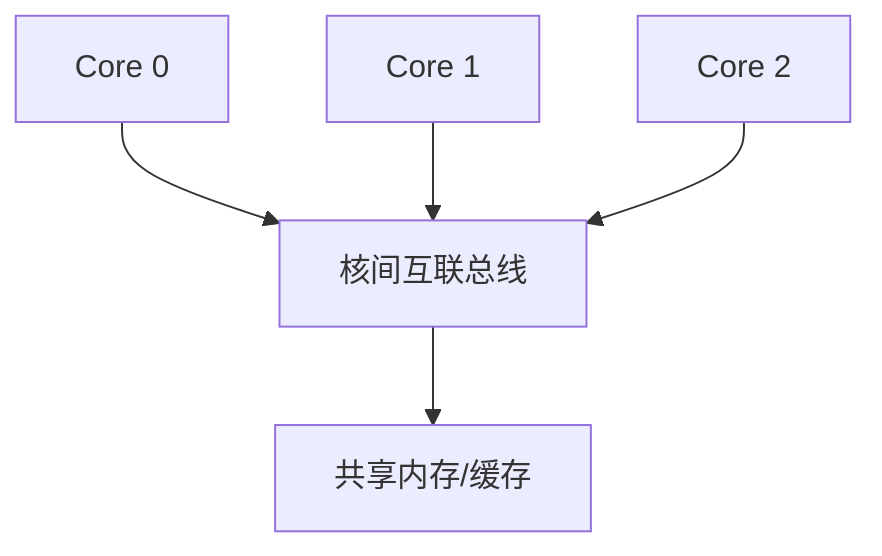

# 配置方法

rv32c 的全部可配置项集中在两层模型：**ISA 配置**（`rv32c.isa` 包：指令集三条轴 xlen × 扩展 × 特权栈）与 **核配置** `CoreConfig`（微架构与平台旋钮）。修改参数后重新生成 RTL / 重新编译仿真即可，核心内部代码无需改动。

## 配置模型分层

| 层 | 类型 | 职责 | 单一事实源 |
|----|------|------|-----------|
| ISA | `rv32c.isa.IsaConfig` | 位宽、扩展、特权栈 | misa 值、`hasMulDiv` 等能力探测、规范名 |
| 扩展 | `rv32c.isa.RvExtension` | 命名扩展（M/A/C/F/D/Zicsr/Zifencei） | `implemented`（当前 RTL 可执行）vs `reserved`（roadmap） |
| 特权 | `rv32c.isa.PrivConfig` | 特权栈形状（M/M-U/M-S-U） | `hasUser/hasSupervisor/hasHypervisor`、栈名 |
| CSR | `rv32c.isa.CsrMap` | CSR 地址、只读性、最低特权 | `implementedFor(isa)` / `readOnlyFor(isa)`，供 CSR 读解码与 EX 合法性检查共用 |
| 异常码 | `rv32c.isa.ExceptionCode` | `mcause` 同步异常编号 | 具名常量（2/3/8/9/11），消除 trap 通路魔法数字 |
| 核 | `CoreConfig` | 复位向量、预测器/缓存占位、多核、调试 | 组合 `IsaConfig`，转发 `xlen/misaValue/hasMulDiv` |

> 译码器 `Decoder` 与 CSR 文件 `CsrFile` 均接收 `IsaConfig`：M 扩展使能、misa 值等不再以散布尔/常量参数传入，而由配置层派生。EX 级 CSR 合法集（已实现地址、只读地址）来自 `CsrMap`，不再硬编码地址链。特权模式合法性同样配置驱动：`PrivConfig.supportedEncodings` 决定哪些 `MPP`/模式编码合法，`privAtLeast(minPriv)` 决定 CSR 访问权限；当 M/U 栈扩展为 M/S/U 时无需改写判定结构。

## ISA 配置（`IsaConfig`）

```scala
case class IsaConfig(
    xlen: Int = 32,                                            // 32 (RV32I) 或 64 (RV64I)，"I" 隐含
    extensions: Set[RvExtension] = Set(RvExtension.Zicsr),     // 使能的扩展
    priv: PrivConfig = PrivConfig.MU                           // 特权栈
)
```

| 字段 | 默认值 | 说明 |
|------|--------|------|
| `xlen` | 32 | 数据路径位宽，`isa-support` 以配置为准生成 |
| `extensions` | `{Zicsr}` | `RvExtension.MulDiv`（M）、`Zicsr` 为 `implemented`；A/C/F/D/Zifencei 为 `reserved`，可命名表达 roadmap 但 `RiscvCore` 实例化时 require 拒绝 |
| `priv` | `M/U` | 结构规则由 `PrivConfig` 强制：M 必选、S 蕴含 U、H 蕴含 S；S/H 为 RV64 专用（当前 RTL 仅实现 M/U） |

### 预设

```scala
IsaConfig.rv32    // RV32I_Zicsr,  M/U   —— 默认 RV32 MCU 基线
IsaConfig.rv32im  // RV32IM_Zicsr, M/U   —— 含乘除扩展
IsaConfig.rv64    // RV64I_Zicsr,  M/S/U —— roadmap 参考，当前 RTL 拒绝实例化
```

**misa 从配置推导**：`misaValue = MXL | I | (U/S 位按特权栈) | 扩展字母位`。默认 RV32 配置得 `0x40100100`（I/U，无 M），`rv32im` 得 `0x40101100`。

## CoreConfig 字段

```scala
case class CoreConfig(
    isa: IsaConfig = IsaConfig.rv32,               // ISA 三轴（单一事实源）
    resetVector: BigInt = 0x00000000L,             // 复位后 PC 初始值
    branchPredictor: BranchPredictorConfig = ...,  // 分支预测器配置
    withICache: Option[CacheConfig] = None,        // 指令缓存
    withDCache: Option[CacheConfig] = None,        // 数据缓存
    numCores: Int = 1,                             // 处理器核数量
    hartId: Int = 0,                               // 硬件线程 ID
    withDebug: Boolean = false                     // 导出调试信号（寄存器堆）
)
```

| 字段 | 默认值 | 说明 |
|------|--------|------|
| `isa` | `IsaConfig.rv32` | ISA 三轴。`CoreConfig` 转发 `xlen/isRV64/hasMulDiv/misaValue/priv` |
| `resetVector` | 0x00000000 | 上电后 PC 起始地址，常见 SoC 用 0x80000000 |
| `branchPredictor` | staticNotTaken | 预留：当前固定"不跳转"预测，可换 BHT/gshare |
| `withICache/DCache` | None | 预留：在总线接口后插入缓存 |
| `numCores` | 1 | 多核数量，为核间互联保留 |
| `hartId` | 0 | 每个核的硬件线程 ID（多核时用于 CSR 等） |
| `withDebug` | false | 仿真观测预留。当前 `RiscvCore` 始终导出 `debugPc/debugRegs/debugMepc/debugMcause/debugMode` 到顶层；该开关保留用于后续按需裁减调试逻辑 |

## 使用示例

### 标准 RV32IM 单核（含乘除扩展）

```scala
val config = CoreConfig.rv32im        // isa = IsaConfig.rv32im
SpinalConfig().generateVerilog(new RiscvCore(config))
```

### 默认纯 RV32I（无 M）

```scala
val config = CoreConfig()             // isa 默认 RV32I_Zicsr, M/U
```

`RiscvCoreGen` 使用 `CoreConfig.rv32im.copy(withDebug = true)`，故 `./scripts/gen-rtl.sh` 生成的 `rtl/RiscvCore.v` 内含除法器、misa = 0x40101100。

### 切换到 RV64IM（M/U 栈）

```scala
val config = CoreConfig(isa = IsaConfig(64, Set(RvExtension.Zicsr, RvExtension.MulDiv), PrivConfig.MU))
```

数据路径、地址、立即数、寄存器堆与访存宽度均按 `isa.xlen` 生成；指令宽度仍是 32 位。RV64 下支持 `*W` 后缀（含 RV64M 的 `MULW/DIVW/DIVUW/REMW/REMUW`）、64 位移位与 `LD/LWU/SD`。

### 表达 roadmap 配置（示例：rv64 M/S/U 基线）

```scala
val config = CoreConfig(isa = IsaConfig(64, Set(RvExtension.Zicsr), PrivConfig.MSU))
```

配置模型可完整表达该结构（含 misa 的 S 位），但 S 模式硬件尚未实现——`RiscvCore` 构造时以 `require` 显式拒绝并给出原因。

### 多核配置（预留）

```scala
val config = CoreConfig(numCores = 4, hartId = 0)
```

当前版本 `RiscvCore` 是单核组件；`numCores` 与 `hartId` 为多核组合预留。多核 SoC 结构：



## 能力校验（RTL 实例化时）

`RiscvCore` 构造时把 `CoreConfig` 与当前 RTL 能力对齐，超范围配置在 elaboration 期即报错：

- 支持：RV32I / RV64I（M/U 栈），扩展限定在 `RvExtension.implemented`（M、Zicsr）；RV64 下 M 扩展按 W 后缀形式实现
- 拒绝：S/H 模式、未实现的扩展（A/C/F/D/Zifencei）、无 Zicsr、纯 M（无 U）
- 被拒绝的是"当前 RTL 尚未实现"，而非"配置模型表达不了"——结构与能力分离

## 参数传递原则

- 配置采用**单点注入**：`CoreConfig` 传入 `RiscvCore`，逐层传给各子模块（ALU、寄存器堆、译码器）
- 一切与指令/CSR/模式相关的位宽与能力均来自 `config.isa`（经 `CoreConfig` 转发），保证全链路一致
- 未实现的扩展（F/缓存/预测器/S/H/RV64）通过 `reserved` 集合与配置旋钮 + 文档说明预留，避免死代码进入 RTL
