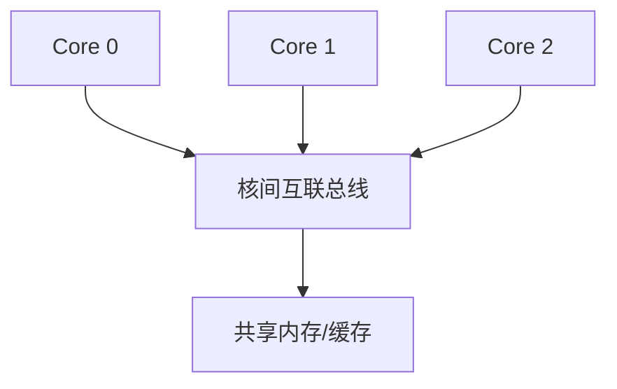

# 配置方法

rv32c 的全部可配置项集中在 `CoreConfig` 中。修改参数后重新生成 RTL / 重新编译仿真即可，核心内部代码无需改动。

## CoreConfig 字段

```scala
case class CoreConfig(
    xlen: Int = 32,                                  // 数据路径位宽：32 或 64
    resetVector: BigInt = 0x00000000L,               // 复位后 PC 初始值
    withMulDiv: Boolean = false,                     // M 扩展（乘除法，EX 段多周期除法器）
    withFpu: Boolean = false,                        // F/D 扩展（浮点）
    branchPredictor: BranchPredictorConfig = ...     // 分支预测器配置
    withICache: Option[CacheConfig] = None,          // 指令缓存
    withDCache: Option[CacheConfig] = None,          // 数据缓存
    numCores: Int = 1,                               // 处理器核数量
    hartId: Int = 0,                                 // 硬件线程 ID
    withDebug: Boolean = false                       // 导出调试信号（寄存器堆）
)
```

| 字段 | 默认值 | 说明 |
|------|--------|------|
| `xlen` | 32 | 数据路径位宽。所有 ALU、寄存器堆、地址、立即数按此参数生成 |
| `resetVector` | 0x00000000 | 上电后 PC 起始地址，常见 SoC 用 0x80000000 |
| `withMulDiv` | false | 使能 RV32M：译码 funct7=0000001 指令，EX 段挂接乘除单元（乘法组合、除法多周期冻结流水线）；关闭时按纯 RV32I 生成，不实例化除法器 |
| `withFpu` | false | 预留：使能 F/D 扩展 |
| `branchPredictor` | staticNotTaken | 预留：当前固定"不跳转"预测，可换 BHT/gshare |
| `withICache/DCache` | None | 预留：在总线接口后插入缓存 |
| `numCores` | 1 | 多核数量，为核间互联保留 |
| `hartId` | 0 | 每个核的硬件线程 ID（多核时用于 CSR 等） |
| `withDebug` | false | 仿真观测预留。当前 `RiscvCore` 始终导出 `debugPc/debugRegs/debugMepc/debugMcause/debugMode` 到顶层；该开关保留用于后续按需裁减调试逻辑 |

## 使用示例

### 标准 RV32I 单核

```scala
val config = CoreConfig() // xlen=32, 单核, 纯 RV32I
SpinalConfig().generateVerilog(new RiscvCore(config))
```

### 使能 RV32IM（乘除扩展）

```scala
val config = CoreConfig(withMulDiv = true)
```

`RiscvCoreGen` 默认即启用 `withMulDiv = true`，故 `./scripts/gen-rtl.sh` 生成的 `rtl/RiscvCore.v` 内含除法器。

### 切到 RV64

```scala
val config = CoreConfig(xlen = 64)
```

所有数据通路按 `xlen` 参数生成，得到 RV64I 核（指令宽度仍为 32 位，符合 RISC-V 规范）。

### 多核配置（预留）

```scala
val config = CoreConfig(numCores = 4, hartId = 0)
```

当前版本 `RiscvCore` 是单核组件；`numCores` 与 `hartId` 为多核组合预留。多核 SoC 结构：



## 参数传递原则

- 配置采用**单点注入**：`CoreConfig` 传入 `RiscvCore`，逐层传给各子模块（ALU、寄存器堆、译码器）
- 所有组件构造函数的位宽参数均来自 `config.xlen`，保证全链路一致
- 未实现的扩展（F/缓存/预测器）通过配置开关 + 文档说明预留，避免死代码进入 RTL
